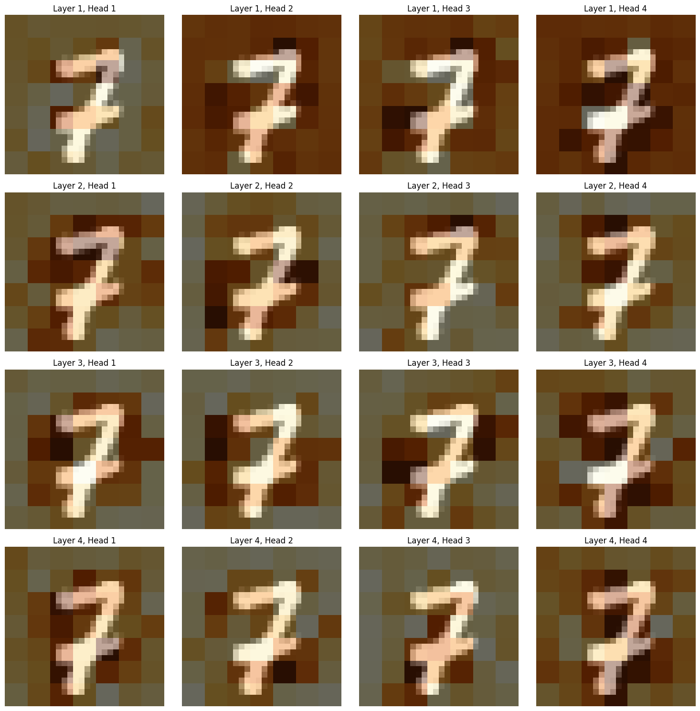

# Vision Transformer Experiments

I was interested in how ViT worked, so implemented one on MNIST. Been following loosely the architecture described in [Dosovitskiy et al. (2020)](https://arxiv.org/abs/2010.11929). Then done some minimal mech interp to see if I could find some attention patterns that would indicate how the models predictions came together.

## Attention Patterns

*Attention pattern visualization showing how different attention heads attend to the input image. The visualization overlays the attention scores from the CLS token to image patches on top of the original image. Each row represents a different transformer layer (1-4) and each column represents a different attention head (1-4). Lighter yellow colors indicate stronger attention from the CLS token to different image patches.*

While one might observe some patterns that could be explained by the input, it's important to note that attention patterns are not reliable measures for interpreting the model. As shown by [Pruthi et al. (2019)](https://arxiv.org/abs/1909.07913), attention mechanisms can be deceptive and may not accurately reflect the model's decision-making process. In the future, I might explore attention rollout techniques ([Abnar & Zuidema, 2020](https://arxiv.org/abs/2005.00928)) to potentially improve the interpretability of these patterns.

## References

- Dosovitskiy, A., Beyer, L., Kolesnikov, A., Weissenborn, D., Zhai, X., Unterthiner, T., Dehghani, M., Minderer, M., Heigold, G., Gelly, S., & others. (2020). An image is worth 16x16 words: Transformers for image recognition at scale. *arXiv preprint arXiv:2010.11929*.
- Pruthi, D., Gupta, M., Dhingra, B., Neubig, G., & Lipton, Z. C. (2019). Learning to deceive with attention-based explanations. *arXiv preprint arXiv:1909.07913*.
- Abnar, S., & Zuidema, W. (2020). Quantifying attention flow in transformers. *arXiv preprint arXiv:2005.00928*.
- LeCun, Y., Cortes, C., & Burges, C. J. (2010). MNIST handwritten digit database. *ATT Labs [Online]. Available: http://yann.lecun.com/exdb/mnist*, 2. 